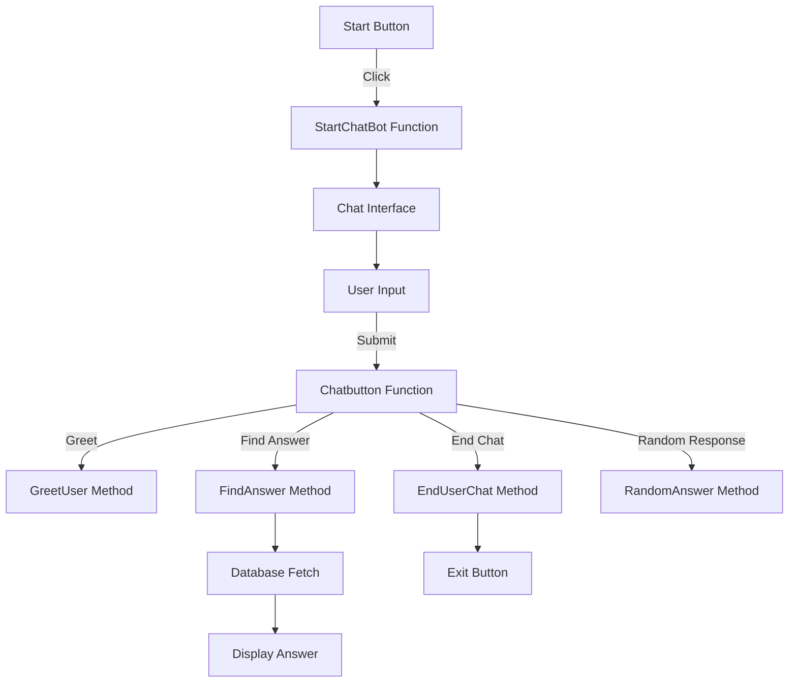

# Introduction

This document will walk you through the implementation of the "SIH-Chatbot". The chatbot is designed to interact with users through a graphical interface, responding to various queries about states and movies.

We will cover:

1. How the chatbot interface is initialized and managed.
2. The role of the database class in handling data queries.
3. How user input is processed and responses are generated.

# Chatbot interface initialization

<SwmSnippet path="/ChatBot 1.0.py" line="19">

---

In this section, we verify whether the object possesses an attribute named 'alve' and return its corresponding value

```python
    def is_alive(self):

        """Objects that are 'alive' should return true."""

        return hasattr(self, 'alive') and self.alive
```

---

</SwmSnippet>

<SwmSnippet path="/ChatBot 2.0.py" line="1">

---

The chatbot interface is initialized using the Tkinter library. The <SwmToken path="/ChatBot 2.0.py" pos="10:2:2" line-data="def StartChatBot():">`StartChatBot`</SwmToken> function is responsible for setting up the main window where the chat interactions occur. This function is crucial as it transitions from the initial screen to the chat interface.

&nbsp;

```
import random
import time
import tkinter
from tkinter import *

mainroot=tkinter.Tk()
mainroot.title("ChatBot")
#mainroot.geometry('450x550')
r=0
def StartChatBot():
#######################################################################################################
    mainroot.destroy()
    root=tkinter.Tk()
    root.title("ChatBot")
    root.geometry('450x550')
    #root.configure(background='yellow')
```

---

</SwmSnippet>

# User input handling

<SwmSnippet path="/ChatBot 2.0.py" line="18">

---

User input is captured through an entry widget, allowing users to type their messages. This input is then processed to determine the appropriate response.

```
    label=tkinter.Label(root,text="Enter your msg : ",font="Times 15")
    label.grid(row=0,column=0)
    user=tkinter.Entry(root,width=30)
    user.grid(row=0,column=1)
```

---

</SwmSnippet>

# Database class for data handling

<SwmSnippet path="/ChatBot 2.0.py" line="23">

---

The <SwmToken path="/ChatBot 2.0.py" pos="23:3:3" line-data="    class database:       #AGENT FUNCTION">`database`</SwmToken> class is designed to fetch data based on user queries. It uses predefined lists to map user input to specific data points, such as state capitals or movie details.

```
    class database:       #AGENT FUNCTION
        def __init__(self,row,column,data):
            self.row=row
            self.column=column
            self.data=data
```

---

</SwmSnippet>

<SwmSnippet path="/ChatBot 2.0.py" line="29">

---

The <SwmToken path="/ChatBot 2.0.py" pos="29:3:3" line-data="        def fetch(self):">`fetch`</SwmToken> method within the <SwmToken path="/ChatBot 2.0.py" pos="23:3:3" line-data="    class database:       #AGENT FUNCTION">`database`</SwmToken> class is responsible for retrieving the correct data indices based on the user's query.

```
        def fetch(self):
            if(self.data==1):
                col=["madhya_pradesh","uttar_pradesh","punjab","bihar","chhattisgarh","goa","gujarat","haryana","himachal pradesh"]
                ro=["temperature","capital","cm","places","population"]
                rowIndex=ro.index(self.row)
                columnIndex=col.index(self.column)
                return (rowIndex,columnIndex)
            elif(self.data==2):
                col1=["year","actor","actress","budget","collection","ratings","verdict"]
                ro1=["bahubali","kgf","dabangg","chappak","good_newz","padmavat","simba"]
                rowIndex=ro1.index(self.column)
                columnIndex=col1.index(self.row)
                return (rowIndex,columnIndex)
```

---

</SwmSnippet>

# Data storage

<SwmSnippet path="/ChatBot 2.0.py" line="42">

---

Data is stored in two separate lists, <SwmToken path="/ChatBot 2.0.py" pos="42:1:1" line-data="    db=[">`db`</SwmToken> and <SwmToken path="/ChatBot 2.0.py" pos="50:1:1" line-data="    db1=[[[&quot;2016&quot;],[&quot;prabas&quot;],[&quot;anushka shetty&quot;],[&quot;180cr&quot;],[&quot;700cr&quot;],[&quot;4.1&quot;],[&quot;blockbuster&quot;]],">`db1`</SwmToken>, which contain information about states and movies, respectively. These lists are accessed by the <SwmToken path="/ChatBot 2.0.py" pos="23:3:3" line-data="    class database:       #AGENT FUNCTION">`database`</SwmToken> class to provide responses to user queries.

```
    db=[
        [["20 degree celcius"],["17 degree celcius"],["11 degree celcius"],["21 degree celcius"],["15 degree celcius"],
        ["27 degree celcius"],["28 degree celcius"],["10 degree celcius"],["14 degree celcius"]],
        [["bhopal"],["lucknow"],["chandigarh"],["city1"],["city2"],["city3"],["city4"],["city5"],["city6"]],
        [["person1"],["person2"],["person3"],["person4"],["person5"],["person6"],["person7"],["person8"],["person9"]],
        [["bhopal,indore,shipuri"],["lucknow,varanasi,jhansi"],["amritsar"],["place4"],["place5"],["beach"],["ahemdabad"],["place7"],["dehradun"]],
        [["2billion"],["2.3billion"],["1.6billion"],["1.9billion"],["0.8billion"],["0.1billion"],["1.4billion"],["1.2billion"],["1.8billion"]]
        ]
    db1=[[["2016"],["prabas"],["anushka shetty"],["180cr"],["700cr"],["4.1"],["blockbuster"]],
        [["2018"],["yash"],["shidhi shetty"],["120cr"],["500cr"],["4.5"],["blockbuster"]],
        [["2019"],["salman khan"],["sunakshi sinha"],["90cr"],["170cr"],["2.1"],["hit"]],
        [["2020"],["none"],["deepika padukon"],["65cr"],["80cr"],["3.6"],["average"]],
        [["2019"],["akshay kumar"],["kareena kapoor"],["68cr"],["160cr"],["3.2"],["hit"]],
        [["2017"],["ranvir singh"],["deepika padukon"],["150cr"],["250cr"],["4.3"],["hit"]],
        [["2019"],["ranvir singh"],["sara ali khan"],["60cr"],["65cr"],["1.6"],["below average"]]
        ]
```

---

</SwmSnippet>

# Chat interaction logic

The <SwmToken path="/ChatBot 2.0.py" pos="60:3:3" line-data="    class chat:">`chat`</SwmToken> class manages the flow of conversation. It includes methods for starting the chat, greeting the user, ending the chat, and finding answers to user queries.

<SwmSnippet path="/ChatBot 2.0.py" line="59">

---

The <SwmToken path="/ChatBot 2.0.py" pos="63:3:3" line-data="        def startfunc(self):">`startfunc`</SwmToken> method displays the user's input on the chat interface.

```
    r=0
    class chat:
        def __init__(self,userInput):
            self.sentence=userInput
        def startfunc(self):
            global r
            r+=1
            label=tkinter.Label(root,text=self.sentence,fg="red",font="Times 10")
            label.grid(row=r,column=0)
```

---

</SwmSnippet>

<SwmSnippet path="/ChatBot 2.0.py" line="69">

---

The <SwmToken path="/ChatBot 2.0.py" pos="69:3:3" line-data="        def greetUser(self):">`greetUser`</SwmToken> method provides a random greeting response when the user initiates a conversation.

```
        def greetUser(self):
            global r
            greet_Response=["hello","hi","hey", "superb bro","namaste"]
            label=tkinter.Label(root,text=(random.choice(greet_Response)),fg="green",font="Times 10")
            label.grid(row=r+1,column=2)
```

---

</SwmSnippet>

<SwmSnippet path="/ChatBot 2.0.py" line="75">

---

The <SwmToken path="/ChatBot 2.0.py" pos="75:3:3" line-data="        def endUserChat(self):">`endUserChat`</SwmToken> method handles the termination of the chat session, providing a farewell message and an exit Testing button.

```
        def endUserChat(self):
            global r
            greet_exit_response=["bye","nice to meet you", "see you later","thanks for talking","have a good day"]
            label=tkinter.Label(root,text=(random.choice(greet_exit_response)),fg="green",font="Times 10")
            label.grid(row=r+1,column=2)
            def kill():
                root.destroy()
            button=tkinter.Button(root,text="Exit",command=kill,width=15)
            button.grid(row=r+2,column=0)
            r+=1
```

---

</SwmSnippet>

<SwmSnippet path="/ChatBot 2.0.py" line="86">

---

The <SwmToken path="/ChatBot 2.0.py" pos="86:3:3" line-data="        def findAnswer(self):">`findAnswer`</SwmToken> method processes the user's query to determine the appropriate response from the database.

```
        def findAnswer(self):
            global r
            self.sentence=self.sentence.split()
            unneccessary=["is","in","what","how","why","tell","me","the","?","of","who","when","was","which"]
            arr=[0,0]
            for i in self.sentence:     #percepts
                if(i not in unneccessary):
                    if(i=="capital" or i=="temperature" or i=="cm" or i=="places" or i=="population" or
                        i=="year" or i=="actor" or i=="actress" or i=="budget" or i=="collection" or i=="ratings" or i=="verdict"):
                        arr[0]=(i)
                    else:
                        arr[1]=i
```

---

</SwmSnippet>

<SwmSnippet path="/ChatBot 2.0.py" line="99">

---

The logic for determining which database to query is split between two conditions, one for state-related queries and another for movie-related queries.

```
            if(arr[0]=="capital" or arr[0]=="temperature" or arr[0]=="cm" or arr[0]=="places" or arr[0]=="population"):
                obj=database(arr[0],arr[1],1)
                row,column=obj.fetch()
                label=tkinter.Label(root,text=(db[row][column]),fg="green",font="Times 10")

            elif(arr[0]=="year" or arr[0]=="actor" or arr[0]=="actress" or arr[0]=="budget" or arr[0]=="collection" or
                     arr[0]=="ratings" or arr[0]=="verdict"):
                    obj=database(arr[0],arr[1],2)
                    row,column=obj.fetch()
                    label=tkinter.Label(root,text=(db1[row][column]),fg="green",font="Times 10")
            label.grid(row=r+1,column=2)
```

---

</SwmSnippet>

<SwmSnippet path="/ChatBot 2.0.py" line="111">

---

If the user's query does not match any known patterns, the <SwmToken path="/ChatBot 2.0.py" pos="111:3:3" line-data="        def randomAnswer(self):          #RANDOM AGENT">`randomAnswer`</SwmToken> method provides a default response.

```
        def randomAnswer(self):          #RANDOM AGENT
            global r
            random_Response=["i did'nt get", "sorry!"]
            label=tkinter.Label(root,text=(random.choice(random_Response)),fg="green",font="Times 10")
            label.grid(row=r+1,column=2)
```

---

</SwmSnippet>

# Chat button functionality

<SwmSnippet path="/ChatBot 2.0.py" line="118">

---

The <SwmToken path="/ChatBot 2.0.py" pos="118:3:3" line-data="    def chatbutton():                         #ENVIRONMENT AND OBJECT">`chatbutton`</SwmToken> function is the core of the interaction, linking user input to the appropriate response method. It checks the input against known keywords and calls the relevant method in the <SwmToken path="/ChatBot 2.0.py" pos="60:3:3" line-data="    class chat:">`chat`</SwmToken> class.

```
    def chatbutton():                         #ENVIRONMENT AND OBJECT
        global r
        statement=user.get()
        statement=statement.lower()
        obj2=chat(statement)
        #obj2.conversation()
        obj2.startfunc()
        greet_Keywords=["hello","hey","hi","what's up","hi there"]
        greet_exit_query=["bye","thanks","thanks alot"]
        if(statement in greet_Keywords):
            obj2.greetUser()
        elif(statement in greet_exit_query):
            obj2.endUserChat()
        elif(("capital" in statement) or ("temperature" in statement) or ("places" in statement) or
                 ("population" in statement) or ("year" in statement) or ("actor" in statement) or
                 ("actress" in statement) or ("budget" in statement) or ("collection" in statement)  or
                 ("ratings" in statement) or ("verdict" in statement)):
            obj2.findAnswer()
        else:
            obj2.randomAnswer()
        r+=1
```

---

</SwmSnippet>

# Interface interaction

<SwmSnippet path="/ChatBot 2.0.py" line="140">

---

A "Send" button is provided for users to submit their input, triggering the <SwmToken path="/ChatBot 2.0.py" pos="118:3:3" line-data="    def chatbutton():                         #ENVIRONMENT AND OBJECT">`chatbutton`</SwmToken> function.

```
    button = tkinter.Button(root, text='Send', width=15,command=chatbutton)

    button.grid(row=0,column=2)
    root.mainloop()
```

---

</SwmSnippet>

<SwmSnippet path="/ChatBot 2.0.py" line="145">

---

The initial interface includes a "START" button to launch the chatbot, transitioning from the main window to the chat interface.

```
########################################################################################################
button = tkinter.Button(mainroot, text='START',font="Times ",width=45,height=5,command=StartChatBot,bg="pink")
button.grid(row=0,column=0)
mainroot.mainloop()
```

---

</SwmSnippet>



# Mermaid diagram

Below is a Mermaid diagram illustrating the flow of the chatbot interaction:

This diagram provides a visual representation of the chatbot's workflow, from initialization to user interaction and response generation.

<SwmMeta version="3.0.0" repo-id="Z2l0aHViJTNBJTNBUHl0aG9uX0NoYXRib3RfQUklM0ElM0FUaGVFYXN5d2F5UHl0aG9u" repo-name="Python_Chatbot_AI"><sup>Powered by [Swimm](https://app.swimm.io/)</sup></SwmMeta>
